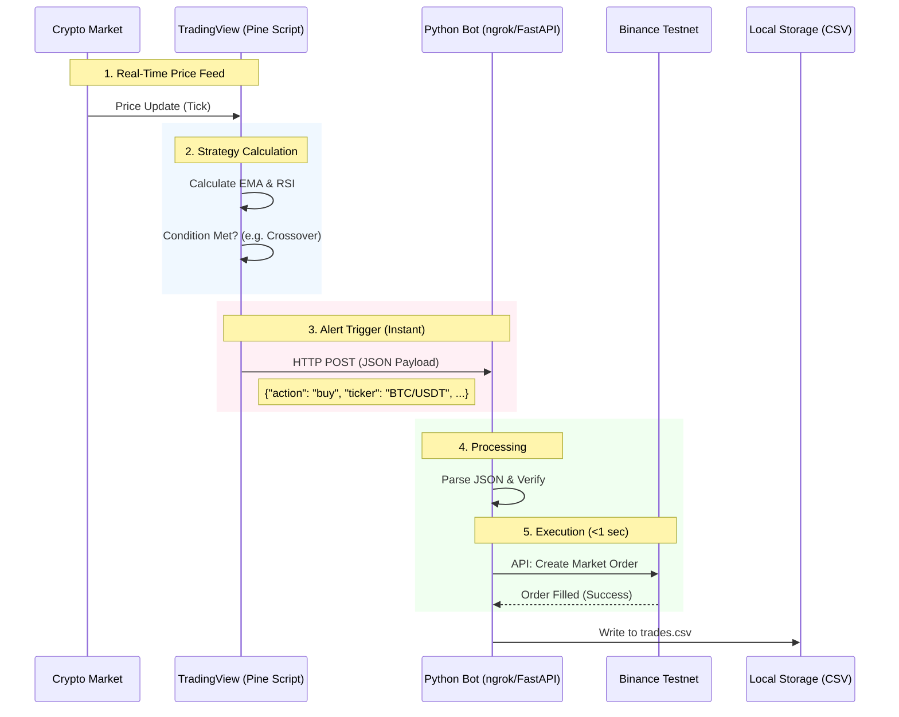

# System Architecture & Requirements

## 1. Real-Time System Flow Diagram

This diagram visualizes the **real-time** data path from the moment price moves on TradingView to the trade execution on Binance Testnet.



---

## 2. Requirements & Prerequisites

To run this system in **Real-Time**, you need the following:

### A. Accounts & Keys
1.  **Binance Futures Testnet Account**
    -   **URL**: [testnet.binancefuture.com](https://testnet.binancefuture.com/en/futures/BTCUSDT)
    -   **Action**: Log in / Register and scroll down to "API Key".
    -   **Need**: `API Key` and `Secret Key`.
    -   *Note*: This uses fake money.

2.  **TradingView Account**
    -   **Action**: You need an account that supports **Webhooks**.
    -   *Note*: Basic (Free) accounts usually do **not** support webhooks. You typically need a Pro plan or a Trial.
    -   *Workaround*: If you don't have Pro, use the `test_webhook.py` script to simulate the signals.

### B. Software Tools
1.  **Python 3.9+** (Installed)
2.  **Ngrok**
    -   **Purpose**: To expose your local Python server (port 5000) to the public internet so TradingView can send data to it.
    -   **Command**: `ngrok http 5000`
    -   **Result**: You get a URL like `https://a1b2-c3d4.ngrok-free.app` -> Use this in TradingView.

### C. Configuration
Update your `config.py` with the keys:
```python
API_KEY = "YOUR_BINANCE_TESTNET_KEY_HERE"
API_SECRET = "YOUR_BINANCE_TESTNET_SECRET_HERE"
TESTNET = True
```
